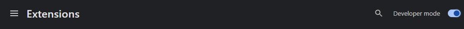
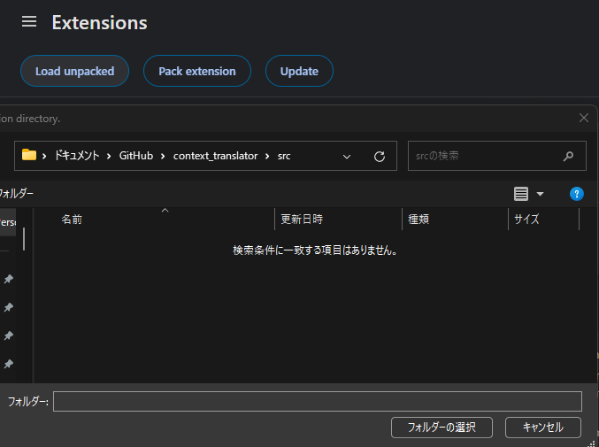
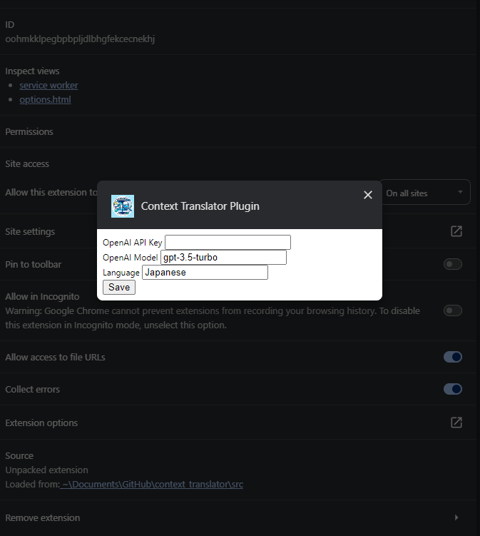

# Context Translator for Chrome

## Installation

1. Enable "Develop mode" in your Chrome browser
   
1. Clone this repository
   ```shell
   git clone https://github.com/borzoicbeing/context_translator.git
   ```
1. Go to `chrome://extensions`
1. "Load unpacked" and select ./src folder so that Context Translator will be installed
   
1. In the "Details" page of the plugin, enter your OpenAI API key.
   
